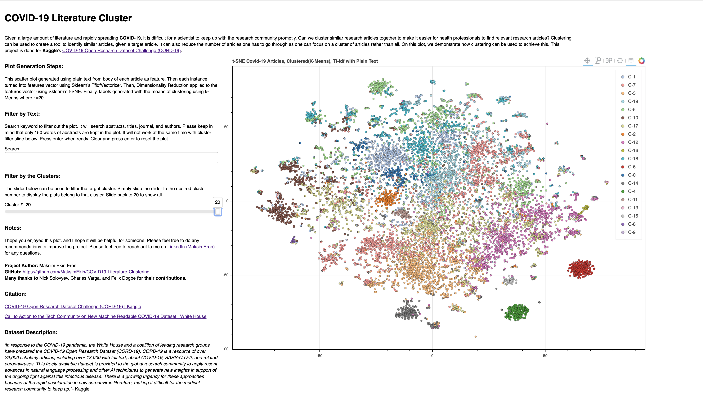
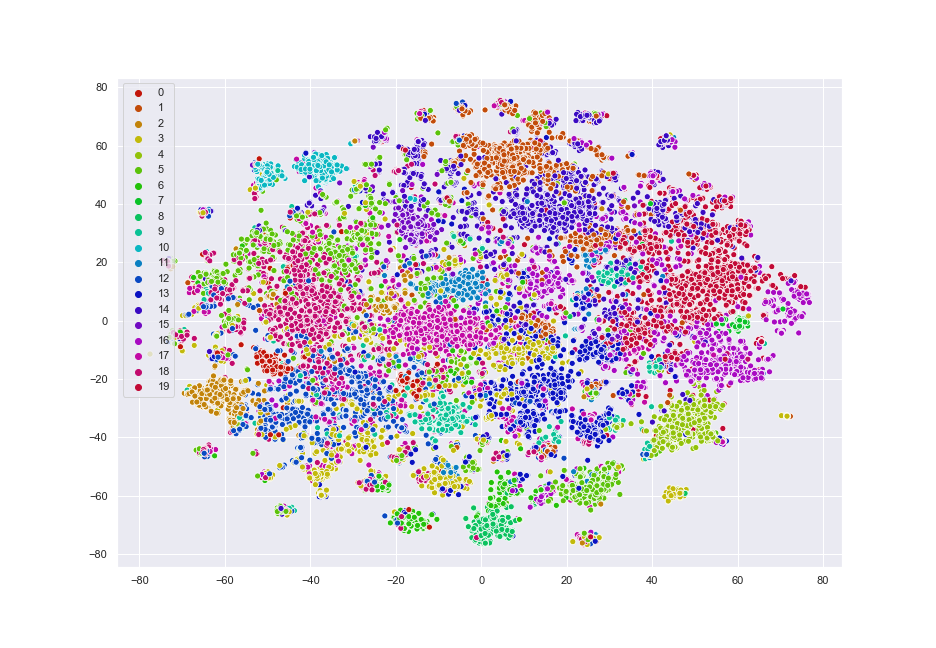

# COVID-19 Literature Clustering

### Goal
Given a large amount of literature and rapidly spreading COVID-19, it is difficult for a scientist to keep up with the research community promptly. Can we cluster similar research articles together to make it easier for health professionals to find relevant research articles? Clustering can be used to create a tool to identify similar articles, given a target article. It can also reduce the number of articles one has to go through as one can focus on a cluster of articles.

### [View the Interactive COVID-19 Literature Clustering Plot](https://maksimekin.github.io/COVID19-Literature-Clustering/plots/t-sne_covid-19_interactive.html)
https://maksimekin.github.io/COVID19-Literature-Clustering/plots/t-sne_covid-19_interactive.html

*t-SNE Output Clustered For Visualization*

**Approach**:
<ol>
    <li>Unsupervised Learning task, because we don't have labels for the articles</li>
    <li>Clustering and Dimensionality Reduction task </li>
    <li>See how well labels from K-Means classify</li>
    <li>Use N-Grams with Hash Vectorizer</li>
    <li>Use plain text with Tfidf</li>
    <li>Use K-Means for clustering</li>
    <li>Use t-SNE for dimensionality reduction</li>
    <li>Use PCA for dimensionality reduction</li>
    <li>There is no continuous flow of data, no need to adjust to changing data, and the data is small enough to fit in memmory: Batch Learning</li>
    <li>Altough, there is no continuous flow of data, our approach has to be scalable as there will be more literature later</li>
</ol>
 

*X Clustered - More Accurate*

### Dataset Description

>*In response to the COVID-19 pandemic, the White House and a coalition of leading research groups have prepared the COVID-19 Open Research Dataset (CORD-19). CORD-19 is a resource of over 29,000 scholarly articles, including over 13,000 with full text, about COVID-19, SARS-CoV-2, and related coronaviruses. This freely available dataset is provided to the global research community to apply recent advances in natural language processing and other AI techniques to generate new insights in support of the ongoing fight against this infectious disease. There is a growing urgency for these approaches because of the rapid acceleration in new coronavirus literature, making it difficult for the medical research community to keep up.*

## Maps
Maps generated using [Novel Corona Virus 2019 Dataset | Kaggle](https://www.kaggle.com/sudalairajkumar/novel-corona-virus-2019-dataset).

- [Time Lapse Map](https://maksimekin.github.io/COVID19-Literature-Clustering/maps/time_lapse.html)
- [Dataset Plot](https://maksimekin.github.io/COVID19-Literature-Clustering/maps/all_map.html)

## Citation/Sources

Dataset/Task: COVID-19 Open Research Dataset Challenge (CORD-19), An AI challenge with AI2, CZI, MSR, Georgetown, NIH & The White House [COVID-19 Open Research Dataset Challenge (CORD-19) | Kaggle](https://www.kaggle.com/allen-institute-for-ai/CORD-19-research-challenge)

Code for loading the dataset into DF(cite): [Dataset Parsing Code | Kaggle, COVID EDA: Initial Exploration Tool](https://www.kaggle.com/ivanegapratama/covid-eda-initial-exploration-tool)

 Clustering section of the project: *Hands-On Machine Learning with Scikit-Learn, Keras, and TensorFlow*, 2nd Edition, by Aurelien Geron (O'Reilly). Copyright 2019 Kiwisoft S.A.S, 978-1-492-03264-9 

[Call to Action to the Tech Community on New Machine Readable COVID-19 Dataset | White House, USA, March 16, 2020](https://www.whitehouse.gov/briefings-statements/call-action-tech-community-new-machine-readable-covid-19-dataset/)
 Kaggle Submission: [COVID-19 Literature Clustering | Kaggle](https://www.kaggle.com/maksimeren/covid-19-literature-clustering#Unsupervised-Learning:-Clustering-with-K-Means)

