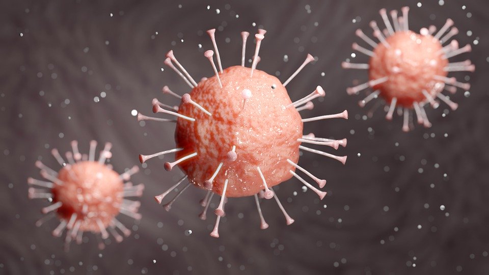
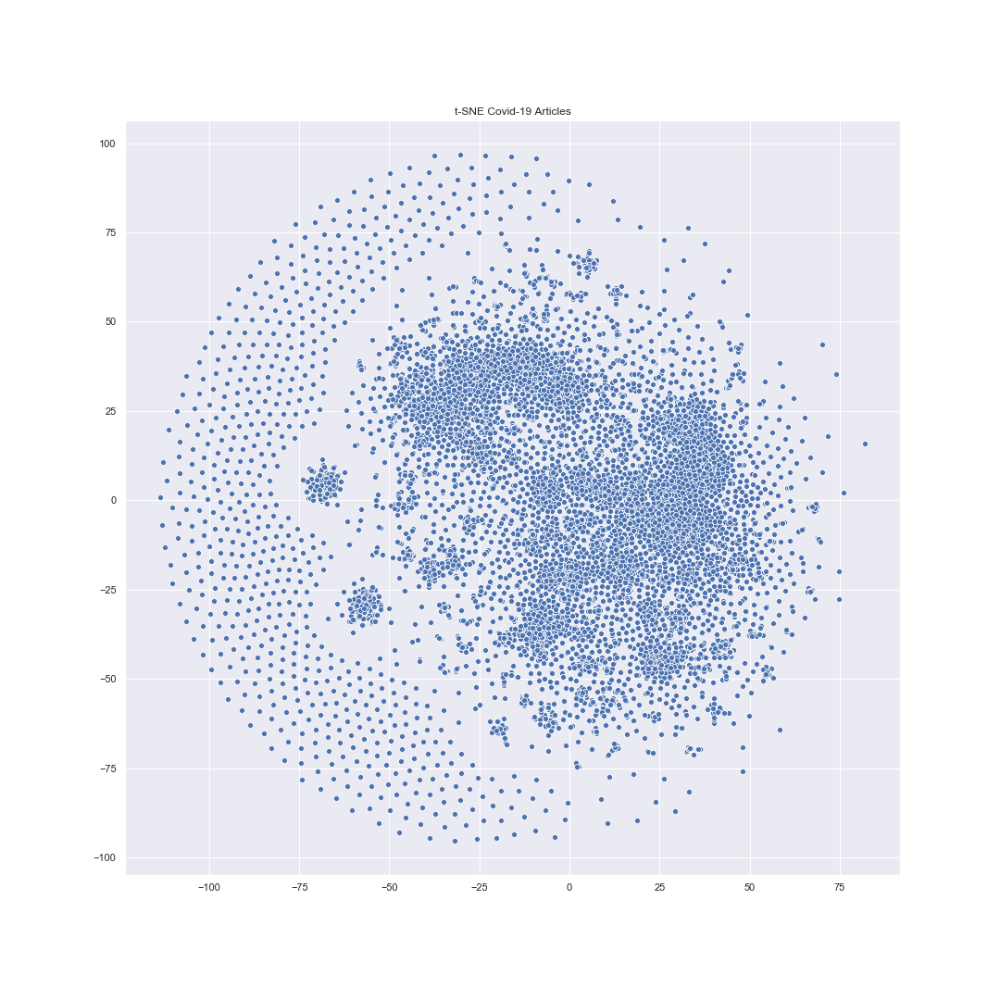
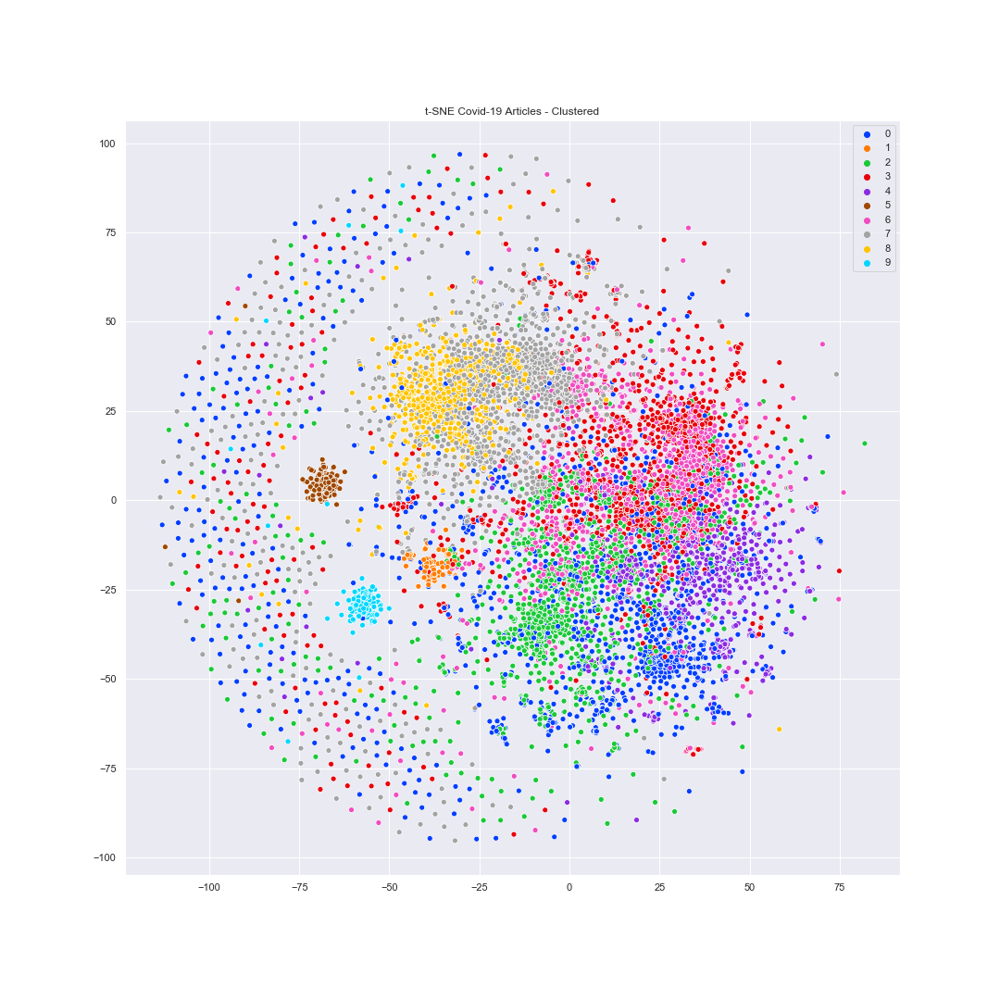

# COVID-19 Literature Clustering

### Goal
Given a large amount of literature and rapidly spreading COVID-19, it is difficult for a scientist to keep up with the research community promptly. Can we cluster similar research articles together to make it easier for health professionals to find relevant research articles? Clustering can be used to create a tool to identify similar articles, given a target article. It can also reduce the number of articles one has to go through as one can focus on a cluster of articles. 

Without Clustering         |  With Clustering
:-------------------------:|:-------------------------:
  |  

### Dataset Description

>*In response to the COVID-19 pandemic, the White House and a coalition of leading research groups have prepared the COVID-19 Open Research Dataset (CORD-19). CORD-19 is a resource of over 29,000 scholarly articles, including over 13,000 with full text, about COVID-19, SARS-CoV-2, and related coronaviruses. This freely available dataset is provided to the global research community to apply recent advances in natural language processing and other AI techniques to generate new insights in support of the ongoing fight against this infectious disease. There is a growing urgency for these approaches because of the rapid acceleration in new coronavirus literature, making it difficult for the medical research community to keep up.*

### Call to Action

>*We are issuing a call to action to the world's artificial intelligence experts to develop text and data mining tools that can help the medical community develop answers to high priority scientific questions. The CORD-19 dataset represents the most extensive machine-readable coronavirus literature collection available for data mining to date. This allows the worldwide AI research community the opportunity to apply text and data mining approaches to find answers to questions within, and connect insights across, this content in support of the ongoing COVID-19 response efforts worldwide. There is a growing urgency for these approaches because of the rapid increase in coronavirus literature, making it difficult for the medical community to keep up.*

>*A list of our initial key questions can be found under the Tasks section of this dataset. These key scientific questions are drawn from the NASEM’s SCIED (National Academies of Sciences, Engineering, and Medicine’s Standing Committee on Emerging Infectious Diseases and 21st Century Health Threats) research topics and the World Health Organization’s R&D Blueprint for COVID-19.*

>*Many of these questions are suitable for text mining, and we encourage researchers to develop text mining tools to provide insights on these questions.*

#### Dataset/Task: [COVID-19 Open Research Dataset Challenge (CORD-19) | Kaggle](https://www.kaggle.com/allen-institute-for-ai/CORD-19-research-challenge)
#### Code for loading the dataset into DF(cite): [Dataset Parsing Code | Kaggle, COVID EDA: Initial Exploration Tool](https://www.kaggle.com/ivanegapratama/covid-eda-initial-exploration-tool)
#### Clustering section of the project (cite): *Hands-On Machine Learning with Scikit-Learn, Keras, and TensorFlow*, 2nd Edition, by Aurelien Geron (O'Reilly). Copyright 2019 Kiwisoft S.A.S, 978-1-492-03264-9 

