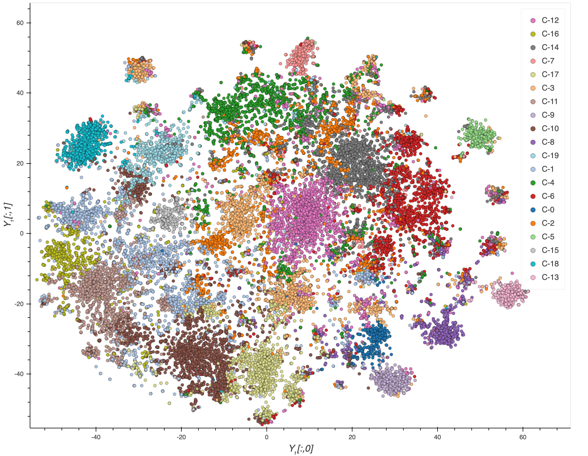
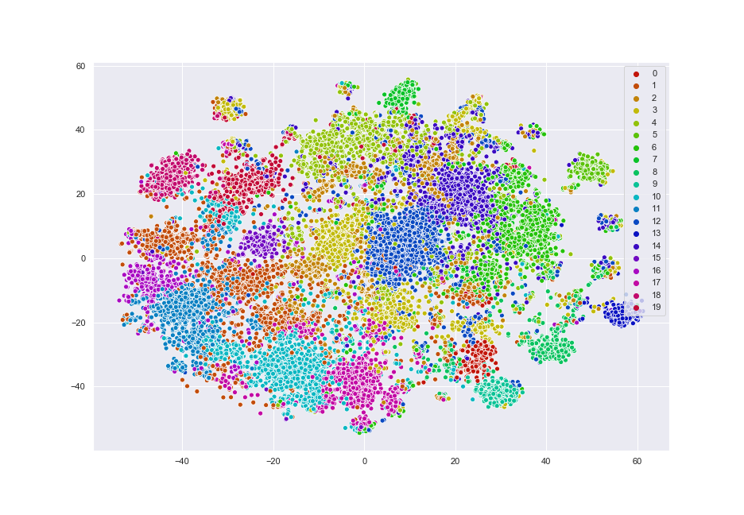

# COVID-19 Literature Clustering



# Goal
Given the large number of literature and the rapid spread of COVID-19, it is difficult for health professionals to keep up with new information on the virus. Can clustering similar research articles together simplify the search for related publications? How can the content of the clusters be qualified?

By using clustering for labelling in combination with dimensionality reduction for visualization, the collection of literature can be represented by a scatter plot. On this plot, publications of highly similar topic will share a label and will be plotted near each other. In order, to find meaning in the clusters, topic modelling will be performed to find the keywords of each cluster.

By using Bokeh, the plot will be interactive. User’s will have the option of seeing the plot as a whole or filtering the data by cluster. If a narrower scope is required, the plot will also have a search function which will limit the output to only papers containing the search term. Hovering over points on the plot will give basic information like title, author, journal, and abstract. Clicking on a point will bring up a menu with a URL that can be used to access the full publication.

This is a difficult time in which health care workers, sanitation staff, and many other essential personnel are out there keeping the world afloat. While adhering to quarantine protocol, the Kaggle CORD-19 competition has given us an opportunity to help in the best way we can as computer science students. It should be noted, however, that we are not epidemiologists, and it is not our place to gauge the importance of these papers. This tool was created to help make it easier for trained professionals to sift through many, many publications related to the virus, and find their own determinations.


- ### [View the Interactive COVID-19 Literature Clustering Plot Here](https://maksimekin.github.io/COVID19-Literature-Clustering/plots/t-sne_covid-19_interactive.html) 
- ### [View the CORD-19 Dataset Analysis Notebook Here](https://maksimekin.github.io/COVID19-Literature-Clustering/COVID19_literature_clustering.html)

##### Chase Pipkin from Freethink put together this great video featuring our work on COVID-19 Literature Clustering
<a href="https://www.youtube.com/watch?v=vyOrM8zC_Iw" rel="Chase Pipkin from Freethink put together this great video featuring our work on COVID-19 Literature Clustering" align="center"></a>


<br>
<br>

## How to Cite This Work?
```
@inproceedings{COVID-19 Literature Clustering,
	author = {Eren, E. Maksim. Solovyev, Nick. Nicholas, Charles. Raff, Edward},
	title = {COVID-19 Literature Clustering},
	year = {2020},
	month = {April},
	location = {University of Maryland Baltimore County (UMBC), Baltimore, MD, USA},
	note={Malware Research Group},
	url = {\url{https://github.com/MaksimEkin/COVID19-Literature-Clustering}},
    howpublished = {TBA}
}
```

<br>

## t-SNE Output Clustered For Visualization




# Approach:

- Parse the text from the body of each document using Natural Language Processing (NLP).
- Turn each document instance di into a feature vector Xi using Term Frequency–inverse Document Frequency (TF-IDF).
- Apply Dimensionality Reduction to each feature vector Xi using t-Distributed Stochastic Neighbor Embedding (t-SNE) to cluster similar research articles in the two dimensional plane X embedding Y1.
- Use Principal Component Analysis (PCA) to project down the dimensions of X to a number of dimensions that will keep .95 variance while removing noise and outliers in embedding Y2.
- Apply k-means clustering on Y2, where k is 20, to label each cluster on Y1.
- Apply Topic Modeling on X using Latent Dirichlet Allocation (LDA) to discover keywords from each cluster.
- Investigate the clusters visually on the plot, zooming down to specific articles as needed, and via classification using Stochastic Gradient Descent (SGD).

<br>

### Dataset Description

>In response to the COVID-19 pandemic, the White House and a coalition of leading research groups have prepared the COVID-19 Open Research Dataset (CORD-19). CORD-19 is a resource of over 51,000 scholarly articles, including over 40,000 with full text, about COVID-19, SARS-CoV-2, and related coronaviruses. This freely available dataset is provided to the global research community to apply recent advances in natural language processing and other AI techniques to generate new insights in support of the ongoing fight against this infectious disease. There is a growing urgency for these approaches because of the rapid acceleration in new coronavirus literature, making it difficult for the medical research community to keep up.
>#### Cite: [COVID-19 Open Research Dataset Challenge (CORD-19) | Kaggle](https://www.kaggle.com/allen-institute-for-ai/CORD-19-research-challenge) 
> #### Kaggle Submission: [COVID-19 Literature Clustering | Kaggle](https://www.kaggle.com/maksimeren/covid-19-literature-clustering#Unsupervised-Learning:-Clustering-with-K-Means)

<br>
<br>


# Conclusion
In this project, we have attempted to cluster published literature on COVID-19 and reduce the dimensionality of the dataset for visualization purposes. This has allowed for an interactive scatter plot of papers related to COVID-19, in which material of similar theme is grouped together. Grouping the literature in this way allows for professionals to quickly find material related to a central topic. Instead of having to manually search for related work, every publication is connected to a larger topic cluster. The clustering of the data was done through k-means on a pre-processed, vectorized version of the literature’s body text. As k-means simply split the data into clusters, topic modeling through LDA was performed to identify keywords. This gave the topics that were prevalent in each of the clusters. Both the clusters and keywords are found through unsupervised learning models and can be useful in revealing patterns that humans may not have even thought about. In no part of this project did we have to manually organize the papers: the results are due to latent connections in the data. 
 
K-means (represented by colors) and t-SNE (represented by points) were able to independently find clusters, showing that relationships between papers can be identified and measured. Papers written on highly similar topics are typically near each other on the plot and bear the same k-means label. However, due to the complexity of the dataset, k-means and t-SNE will sometimes arrive at different decisions. The topics of much of the given literature are continuous and will not have a concrete decision boundary. This may mean that k-means and t-SNE can find different similarities to group the papers by. In these conditions, our approach performs quite well.

As this is an unsupervised learning problem, the evaluation of our work was not an exact science. First, the plot was examined to assert that clusters were actually being formed. After being convinced of this, we examined the titles/abstracts of some of the papers in different clusters. For the most part, similar research areas were clustered. Our last evaluation method was classification. By training a classification model with the k-means labels and then testing it on a separate subset of the data, we could see that the clustering was not completely arbitrary as the classifier performed well. 

Our manual inspection of the documents was quite limited, as neither of the authors are qualified to assess the meaning of the literature. Even so, it was apparent that articles on key topics could be easily found in close proximity to each other. For example, searching for 'mask' can reveal a sub cluster of papers that evaluate the efficacy of masks.  We believe that health professionals can use this tool to find real links in the texts. By organizing the literature, qualified people can quickly find related publications that answer the task questions. This project can further be improved by abstracting the underlying data analysis techniques as described in this notebook to develop a user interface/tool that presents the related articles in a user-friendly manner.


<br>
<br>

**Some areas we thought were great:** (pros)
- The tool is saved as an html file. It can be downloaded and used locally/offline.
- It is portable/mobile, easily deployable, and failover safe; the risk of denial of service in the case of emergencies such as the loss of network connection is mitigated
- Dimensionality reduction allows for the whole dataset to be easily accessible. The papers are all up on the plot and can be quickly examined by hovering over them. If the abstract seems interesting, the user can click on the point to bring up a text box with more information that will contain a link to the full paper
- Patterns in the data found through clustering/dimensionality reduction may not be readily apparent to researchers. These unsupervised techniques can show humans hidden connnections in the literature
- If the topics/clusters are not narrow enough for the user, a search for a key term that will only bring up papers that contain the search term. Search can be performed inside of a selected cluster or the entire dataset if preferred. This increases the flexibility of how patterns can be discovered.
- A surface level examination of the plot showed some very interesting organization of the data. For example, one subcluster consisted of papers that tried to determine the efficacy of masks in preventing the spread of COVID-19.
- Once the models are trained, the results can be generated in constant time.
- This work can be easily replicated and modified as needed, serving as a foundation for future projects.

<br>

**Future thoughts to consider:** (cons)
- Possible false positives, difficult to draw an exact line between subjects
- K-means and t-SNE are unsupervised approaches that will not necessarily group instances in a predictable way. Due to their unsupervised nature, there is no 'right answer' for how the papers should be clustered. This could be difficult to debug if problems arise.
- Loss of foreign language papers. This leads to the loss of experience from different geographic locations on dealing with COVID-19
- The algorithms used in this notebook are stochastic so the results may vary depending on the random state. In this notebook all of the algorithms are set to random state 42 (the meaning of life) to ensure reproducible results
- Long run time to train models on large dataset of literature

<br>
<br>

# Citation/Sources

Kaggle Submission: [COVID-19 Literature Clustering | Kaggle](https://www.kaggle.com/maksimeren/covid-19-literature-clustering#Unsupervised-Learning:-Clustering-with-K-Means)
 
 ```
@inproceedings{Raff2020,
	author = {Raff, Edward and Nicholas, Charles and McLean, Mark},
	booktitle = {The Thirty-Fourth AAAI Conference on Artificial Intelligence},
	title = {{A New Burrows Wheeler Transform Markov Distance}},
	url = {http://arxiv.org/abs/1912.13046},
	year = {2020},
}
```
```
@misc{Kaggle,
	author = {Kaggle},
	title = {COVID-19 Open Research Dataset Challenge (CORD-19)},
	year = {2020},
	month = {March},
	note = {Allen Institute for AI in partnership with the Chan Zuckerberg Initiative, Georgetown University’s Center for   Security and Emerging Technology, Microsoft Research, and the National Library of Medicine - National Institutes of Health, in coordination with The White House Office of Science and Technology Policy.},
	howpublished = {\url{https://www.kaggle.com/allen-institute-for-ai/CORD-19-research-challenge}}
}
```
```
@inproceedings{Shakespeare,
	author = {Nicholas, Charles},
	title = {Mr. Shakespeare, Meet Mr. Tucker},
	booktitle = {High Performance Computing and Data Analytics Workshop},
	year = {2019},
	month = {September},
	location = { Linthicum Heights, MD, USA},
}
```
```
@inproceedings{raff_lzjd_2017,
	author = {Raff, Edward and Nicholas, Charles},
	title = {An Alternative to NCD for Large Sequences, Lempel-Ziv Jaccard Distance},
	booktitle = {Proceedings of the 23rd ACM SIGKDD International Conference on Knowledge Discovery and Data Mining},
	series = {KDD '17},
	year = {2017},
	isbn = {978-1-4503-4887-4},
	location = {Halifax, NS, Canada},
	pages = {1007--1015},
	numpages = {9},
	url = {http://doi.acm.org/10.1145/3097983.3098111},
	doi = {10.1145/3097983.3098111},
	acmid = {3098111},
	publisher = {ACM},
	address = {New York, NY, USA},
	keywords = {cyber security, jaccard similarity, lempel-ziv, malware classification, normalized compression distance},
}
```
```
@inproceedings{ML_Book,
    author = {Aurélien Geron},
    title = {Hands-On Machine Learning with Scikit-Learn, Keras, and TensorFlow},
    pages = {91, 233},
    series = {2},
    year = {2019},
    isbn = {978-1-492-03264-9},
    publisher = {O'Reilly},
    copyright = {Kiwisoft S.A.S},
}
```

<br>

## Maps
Maps generated using [Novel Corona Virus 2019 Dataset | Kaggle](https://www.kaggle.com/sudalairajkumar/novel-corona-virus-2019-dataset).

- [Time Lapse Map](https://maksimekin.github.io/COVID19-Literature-Clustering/maps/time_lapse.html)
- [Dataset Plot](https://maksimekin.github.io/COVID19-Literature-Clustering/maps/all_map.html)
